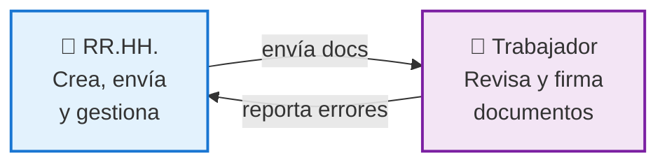
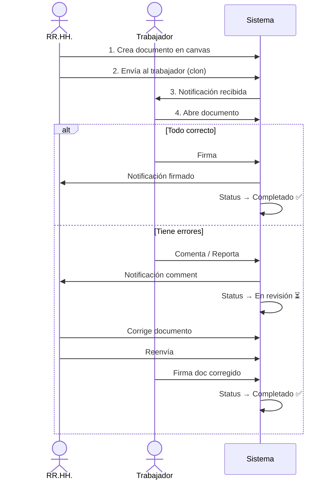

# Paperly

**Sistema de gestión documental con firma digital para Recursos Humanos**

Desarrollado para el [Hackathon CubePath 2026](https://github.com/midudev/hackaton-cubepath-2026).

---

## ¿Qué es Paperly?

Paperly permite que equipos de RR.HH. creen, envíen y gestionen documentos con firma digital. Los trabajadores reciben documentos, los revisan, pueden reportar errores y firmarlos desde cualquier dispositivo.

---

## Actores y sus acciones

### RR.HH. 👔
Crea documentos en un canvas editor, los envía a trabajadores y gestiona sus respuestas.

### Trabajador 👷
Recibe documentos, los revisa, firma digitalmente y reporta errores si es necesario.



---

## Flujo de un documento



---

## Características principales

- **Canvas editor** — Crea documentos con drag & drop (imágenes, texto, firmas)
- **Firma digital** — Trabajadores firman desde cualquier dispositivo
- **Notificaciones en vivo** — Campana con contador de no leídas
- **Seguimiento** — Mira el estado de cada documento (enviado, visto, firmado, etc.)
- **Comentarios** — Trabajadores reportan errores, RR.HH. responde
- **Plantillas** — Guarda documentos como plantilla para reutilizar
- **Responsivo** — Funciona en escritorio, tablet y móvil

---

## Quick Start

### Requisitos
- [Bun](https://bun.sh) >= 1.2
- Docker / Docker Compose

### Levantar local

```bash
# 1. Clonar
git clone https://github.com/clix002/Paperly
cd Paperly

# 2. Instalar dependencias
bun install

# 3. Levantar base de datos (PostgreSQL)
docker compose up -d

# 4. Crear tablas
cd packages/db && bun run db:push && cd ../..

# 5. API (Terminal 1)
cd apps/api && bun run dev

# 6. Web (Terminal 2)
cd apps/web && bun run dev -- -p 3001
```

**URLs:**
- Web: http://localhost:3001
- API: http://localhost:3000

**Usuarios de prueba:**
```
HR:     ana@paperly.com / password123
Worker: maria@paperly.com / password123
```

---

## Deploy en CubePath

```bash
# Dokploy (recomendado)
1. Crear VPS (Ubuntu 22, 4GB RAM, ~$10/mes)
2. SSH: ssh root@TU_IP
3. Instalar: curl -fsSL https://dokploy.com/install.sh | sh
4. Panel: http://TU_IP:3000
5. Conectar GitHub repo
6. Deploy automático
```

Ver [DEPLOY.md](./DEPLOY.md) para detalles.

---

## Estructura del proyecto

```
Paperly/
├── apps/
│   ├── api/           # Backend (Bun + Hono + GraphQL)
│   └── web/           # Frontend (Next.js + Apollo)
├── packages/
│   ├── db/            # Schema Drizzle (PostgreSQL)
│   └── shared/        # Tipos, enums, schemas (compartidos)
├── docs/              # Documentación técnica
├── docker-compose.yml
├── DEPLOY.md          # Guía de deploy
└── CLAUDE.md          # Contexto para desarrollo
```

---

## Stack técnico

| Capa | Tecnología |
|------|-----------|
| **Runtime** | Bun |
| **Backend** | Hono + GraphQL Yoga |
| **Frontend** | Next.js 16 + Apollo Client |
| **Base de datos** | PostgreSQL + Drizzle ORM |
| **Auth** | Better Auth |
| **Canvas** | Fabric.js v7 |
| **UI** | shadcn/ui + Tailwind CSS 4 |
| **Monorepo** | Bun Workspaces + Turborepo |

---

## Roles

| Rol | Acceso |
|-----|--------|
| **hr** | Crear docs, enviar, responder, ver tracking |
| **worker** | Recibir docs, firmar, comentar |

---

## Documentación

- **[DEPLOY.md](./DEPLOY.md)** — Cómo desplegar en CubePath
- **[docs/](./docs/)** — Documentación técnica detallada

---

## Hackathon CubePath 2026

Proyecto oficial para el [Hackathon CubePath 2026](https://github.com/midudev/hackaton-cubepath-2026).

Organizado por [@midudev](https://github.com/midudev).

---

**Hecho con ❤️ para RR.HH. moderno**
