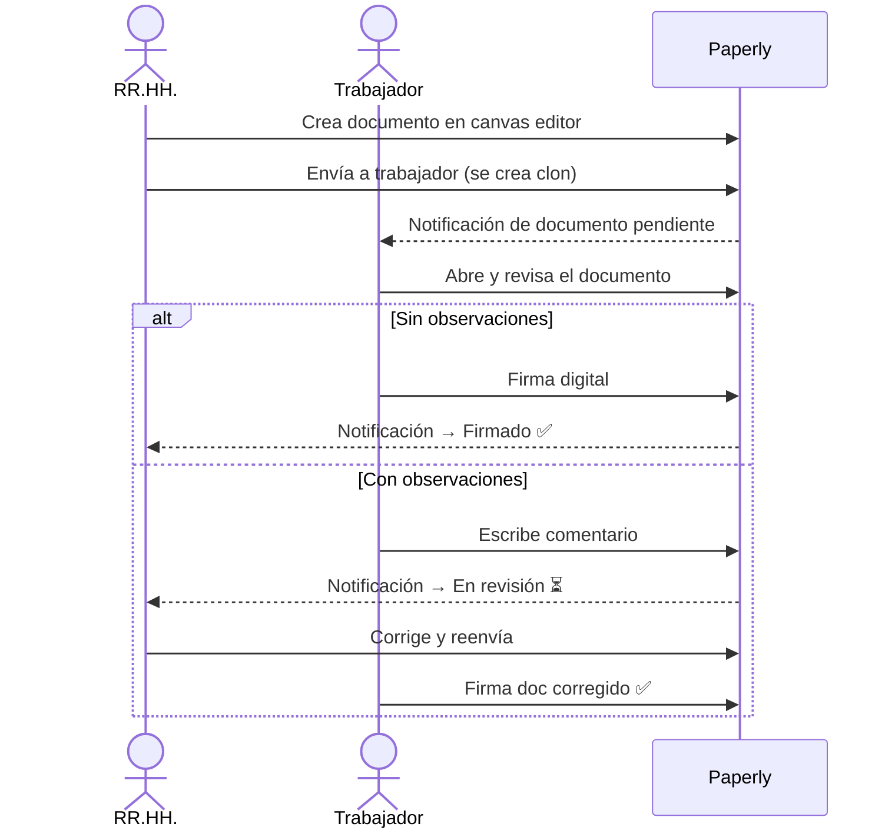

# Paperly

Sistema de gestión documental con firma digital para Recursos Humanos.

Desarrollado para el [Hackathon CubePath 2026](https://github.com/midudev/hackaton-cubepath-2026) por [@clix002](https://github.com/clix002).

---

## El problema que resuelve

Los equipos de RR.HH. gestionan contratos, acuerdos y comunicados de forma manual: imprimen, escanean, envían por correo y archivan físicamente. El proceso es lento, propenso a errores y sin trazabilidad.

**Paperly lo resuelve así:**

| Problema | Solución |
|----------|----------|
| Crear documentos es lento | Editor canvas drag & drop con plantillas reutilizables |
| Distribución por correo sin control | Envío digital con tracking de estado por documento |
| Firma en papel o PDF enviado por mail | Firma digital integrada con verificación por contraseña |
| Sin visibilidad del estado | Dashboard con estadísticas y vista kanban de seguimiento |
| Errores sin canal formal | Sistema de comentarios worker ↔ RR.HH. con flujo de revisión |
| Imágenes y firmas se pierden | Almacenamiento persistente en Cloudflare R2 |

---

## Demo rápida

| Rol | Email | Contraseña |
|-----|-------|-----------|
| RR.HH. | `ana@paperly.com` | `password123` |
| RR.HH. | `carlos@paperly.com` | `password123` |
| Trabajador | `maria@paperly.com` | `password123` |
| Trabajador | `juan@paperly.com` | `password123` |
| Trabajador | `sofia@paperly.com` | `password123` |

> Los usuarios ya están creados. Solo ingresá y explorá.

---

## Flujo principal



---

## Stack

| Capa | Tecnología |
|------|-----------|
| Runtime | Bun |
| Monorepo | Bun Workspaces + Turborepo |
| Backend | Hono + GraphQL Yoga |
| Base de datos | PostgreSQL + Drizzle ORM |
| Auth | Better Auth |
| Frontend | Next.js 16 + Apollo Client 4 |
| Canvas editor | Fabric.js v7 |
| Almacenamiento | Cloudflare R2 (S3-compatible) |
| UI | shadcn/ui + Tailwind CSS 4 |
| Linter | Biome 2 |

---

## Quick start

```bash
git clone https://github.com/clix002/Paperly && cd Paperly
bun install
docker compose up -d
cd packages/db && bun run db:push && cd ../..
# Terminal 1
bun run dev --filter=api
# Terminal 2
bun run dev --filter=web
```

- Web → http://localhost:3001
- API → http://localhost:3000

---

## Documentación técnica

- [docs/ARCHITECTURE.md](./docs/ARCHITECTURE.md) — Arquitectura, decisiones técnicas y diagramas
- [DEPLOY.md](./DEPLOY.md) — Guía de deploy en CubePath con Dokploy
