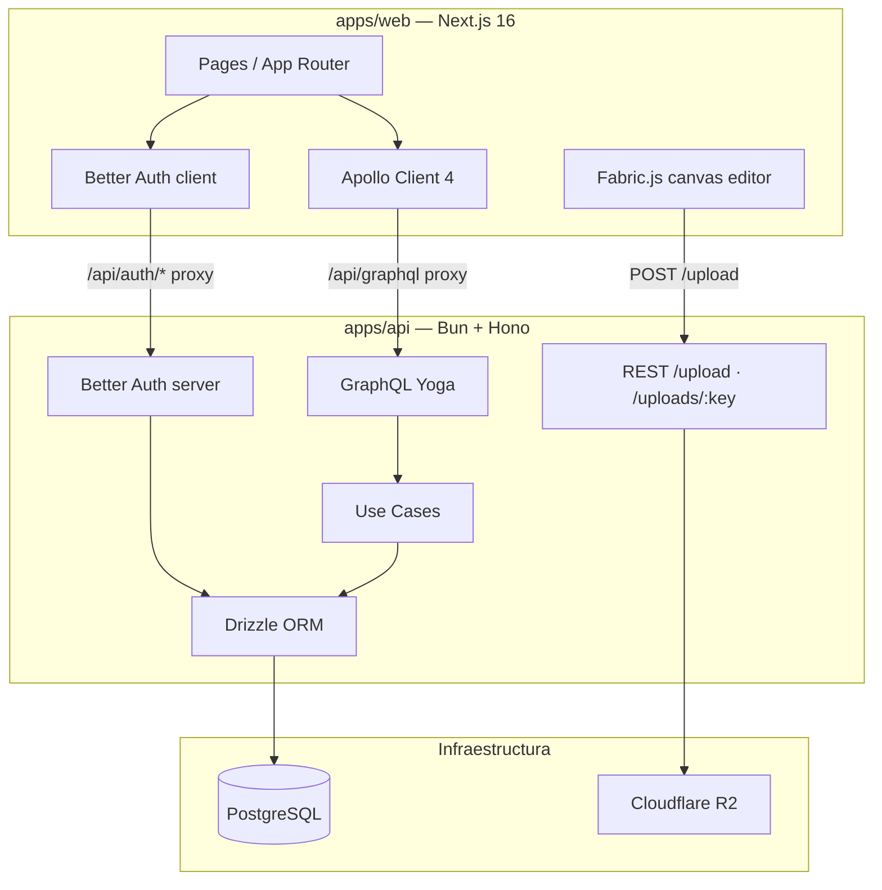
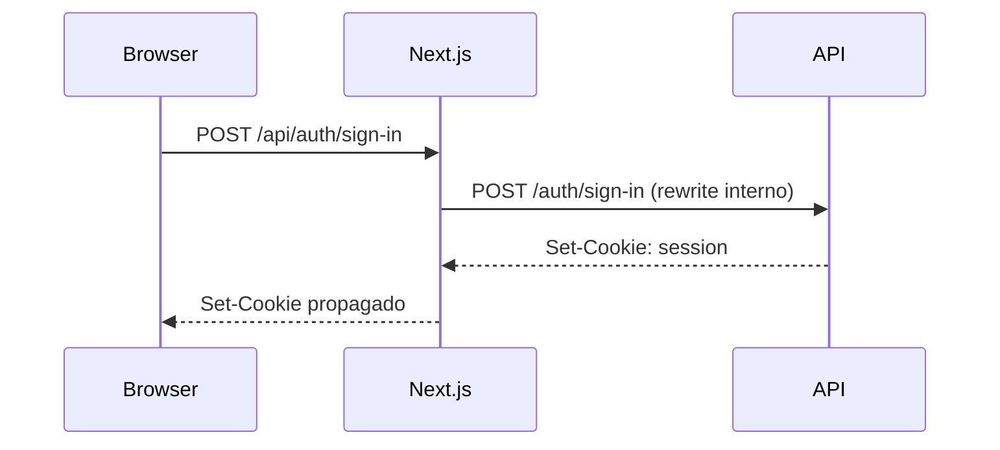
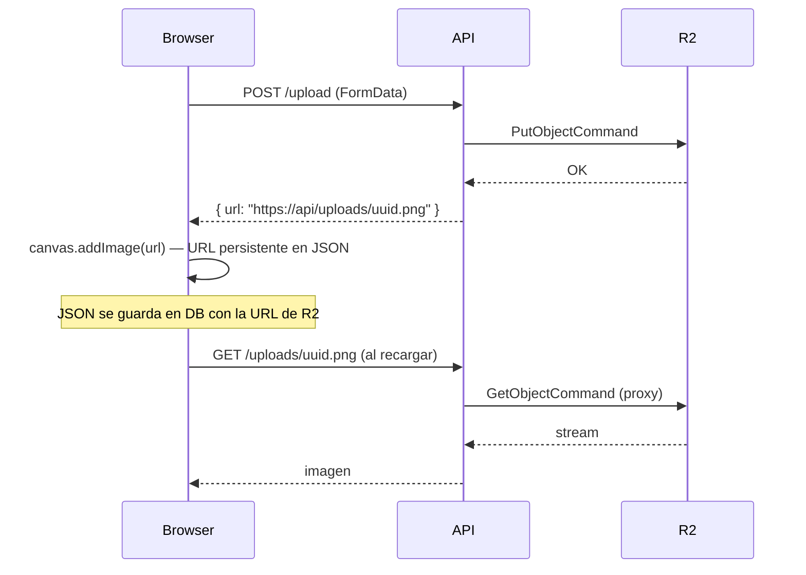
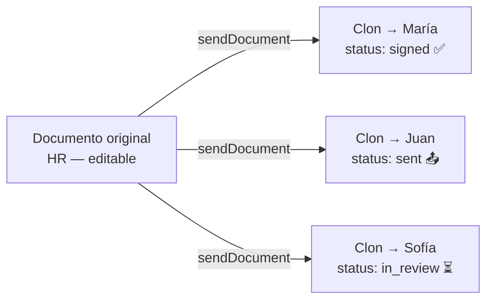
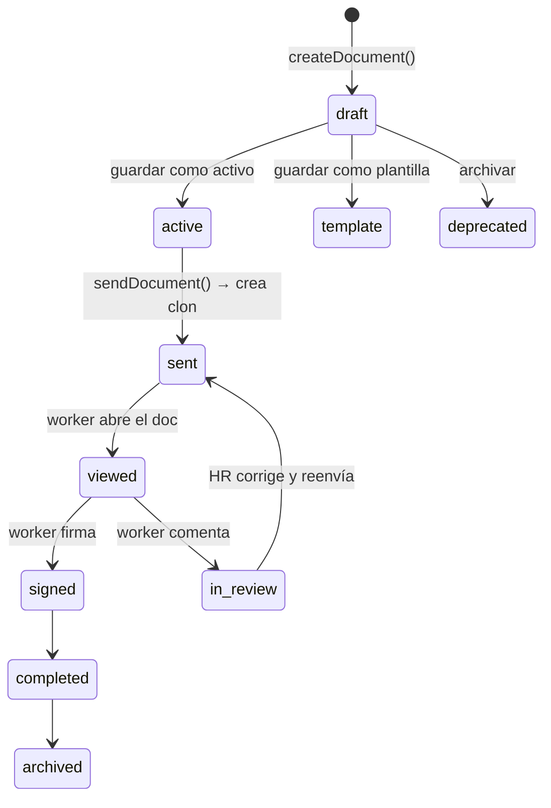

# Arquitectura de Paperly

---

## Estructura del monorepo

```
Paperly/
├── apps/
│   ├── api/        ← Bun + Hono + GraphQL Yoga + Better Auth + Drizzle
│   └── web/        ← Next.js 16 + Apollo Client 4 + Better Auth client
├── packages/
│   ├── db/         ← Schema Drizzle + cliente PostgreSQL
│   └── shared/     ← Enums, Zod schemas, tipos TS compartidos
├── docker-compose.yml
└── turbo.json
```

El código compartido (`packages/shared`, `packages/db`) nunca tiene lógica de UI ni de servidor — solo tipos, schemas de validación y el cliente de base de datos.

---

## Capas del sistema



---

## Autenticación

Better Auth maneja toda la capa de auth. En el frontend, las llamadas van a `/api/auth/*` que Next.js reescribe internamente hacia `http://api:4000/auth/*`.



La sesión viaja como cookie `httpOnly`. Apollo incluye `credentials: "include"` en cada request.

---

## GraphQL

Schema dividido por dominio en `apps/api/src/graphql/typedefs/`:

```
typedefs/
├── user/       ← me, users, saveUserSignature
├── document/   ← getDocuments, getDocumentById, CRUD, send, sign
└── comment/    ← getComments, createComment, commentAdded (subscription)
```

El frontend usa codegen (`@graphql-codegen`) para generar tipos TypeScript y `DocumentNode` tipados desde el schema. Nunca se escriben queries como strings en el cliente.

### Suscripciones en tiempo real

Los comentarios usan GraphQL Subscriptions via WebSocket (`graphql-transport-ws`). El servidor Bun maneja el upgrade directamente antes de pasar al handler de Hono:

```
Browser → ws://api:3000/graphql → Bun WS → graphql-ws makeServer → PubSub
```

El hook `useComments` (web) centraliza query + subscription + mutation. Cuando llega un `commentAdded`, escribe directo al cache de Apollo sin refetch.

### IA automática (Groq)

Cuando un worker envía una observación, el servidor dispara `sendAiResponse` sin await (fire & forget). Groq (llama-3.3-70b) genera la respuesta y se publica via pubsub — llega al browser en tiempo real por la misma suscripción.

```
createComment → pubsub.publish(userComment) → [async] Groq API → pubsub.publish(aiComment)
```

---

## Almacenamiento de archivos (Cloudflare R2)

**Problema:** `URL.createObjectURL()` genera URLs de blob temporales que no sobreviven un reload. Las imágenes y firmas insertadas en el canvas desaparecían al recargar.

**Solución:**



Las URLs en el JSON del canvas siempre apuntan al proxy del API. Al recargar, Fabric.js las fetchea normalmente.

---

## Documentos y clones

El documento **original** vive en el sistema de HR. Al enviarlo, se crea un **clon** por trabajador con referencia al original (`originalId`).



Esto permite reenviar el mismo documento a múltiples trabajadores de forma independiente y mantener el original intacto.

---

## Estados del documento



---

## Decisiones técnicas

### ¿Por qué Bun?
Runtime único para todo el monorepo. Más rápido que Node en I/O, TypeScript nativo sin compilar, compatible con el ecosistema npm.

### ¿Por qué GraphQL + REST mixto?
GraphQL para el dominio de negocio — el cliente pide exactamente los campos que necesita. REST solo para uploads (`/upload`) porque `multipart/FormData` es más simple que base64 sobre GraphQL.

### ¿Por qué Better Auth en lugar de Supabase Auth?
Control total sobre el schema de usuario (campos custom: `signatureUrl`, `role`) sin depender de un servicio externo. La sesión es una cookie `httpOnly` gestionada por el propio API.

### ¿Por qué Fabric.js?
Editor canvas maduro con serialización/deserialización JSON, grupos, transformaciones y modos (edición completa vs. solo firma). Adaptado de un proyecto previo.

### ¿Por qué Cloudflare R2?
Free tier generoso (10 GB/mes, sin costo por egress). API S3-compatible — se usa `@aws-sdk/client-s3` sin SDK propietario. Las imágenes se sirven via proxy del API para evitar CORS y problemas con URLs públicas de desarrollo.
