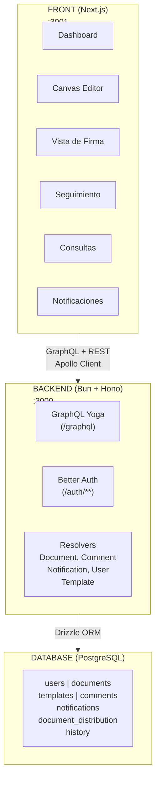
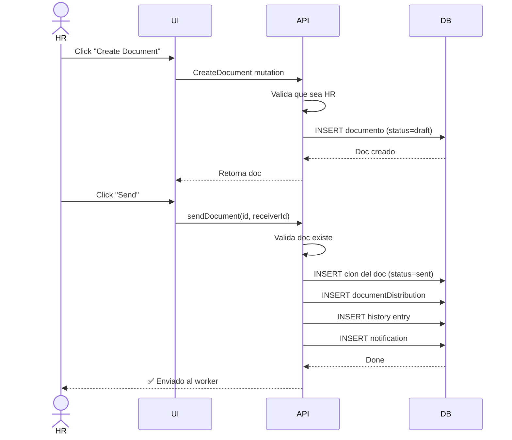
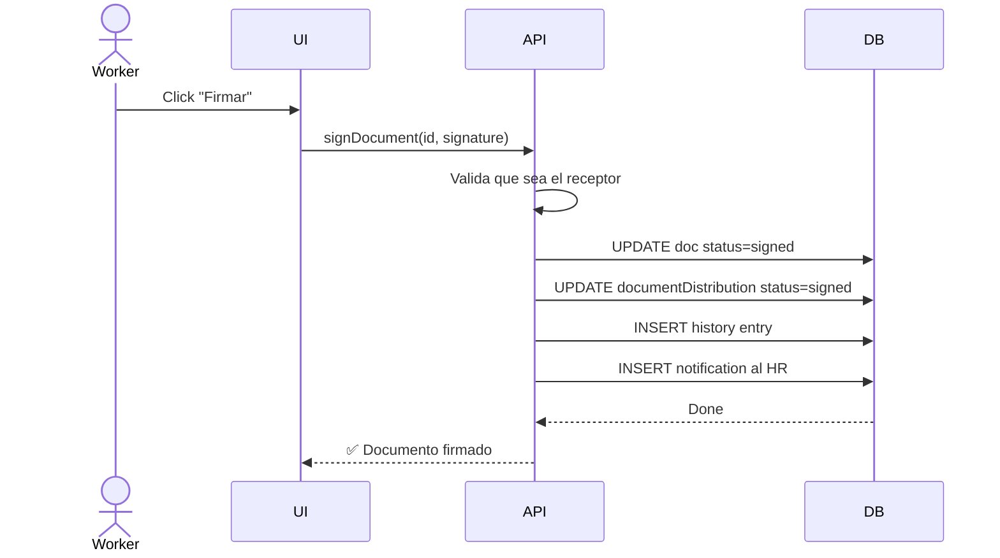
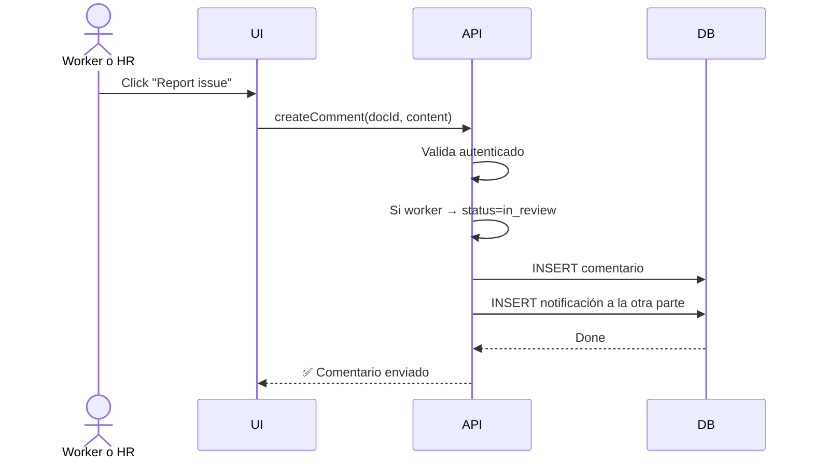
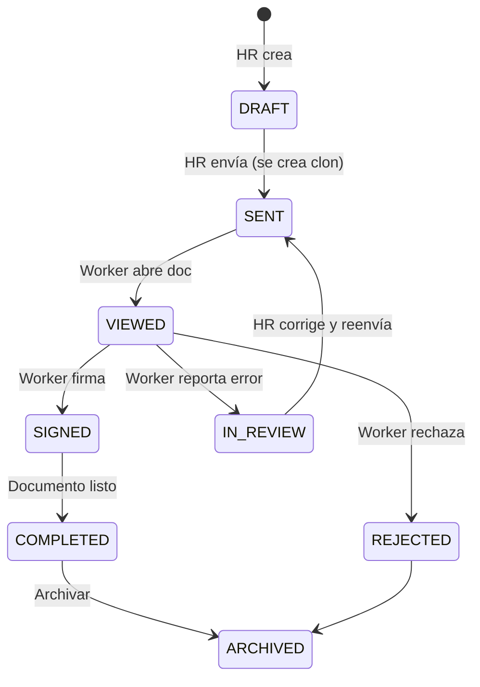

# Arquitectura de Paperly

## Visión general



---

## Carpetas clave

### `/apps/api`
- **`src/index.ts`** — Punto de entrada, Hono app
- **`src/graphql/`** — Typedefs, resolvers, schema
- **`src/usecase/`** — Lógica de negocio (CRUD, workflows)
- **`src/auth/`** — Rutas de Better Auth
- **`src/lib/env.ts`** — Variables de entorno

### `/apps/web`
- **`app/(app)/`** — Rutas principales
  - `dashboard/` — Worker: lista de docs
  - `hr/` — RR.HH.: dashboard, documents, send, queries, tracking
- **`components/`** — Componentes reutilizables
  - `layout/` — Sidebar, header, notificaciones
  - `editor/` — Canvas editor (Fabric.js)
  - `hr/` — Componentes HR (attention-list, tracking-kanban, etc.)
- **`lib/apollo/`** — GraphQL operations (`.graphql` + generados)

### `/packages/db`
- **`src/schema/`** — Tablas Drizzle (user, document, comment, etc.)
- **`drizzle.config.ts`** — Configuración ORM

### `/packages/shared`
- **`enums/`** — Enums tipados (Role, DocumentStatus, NotificationType)
- **`schemas/`** — Zod schemas para validación

---

## Flujo de datos

### 1. Crear y enviar documento



### 2. Firma del documento



### 3. Comentario (error/observación)



---

## Estados del documento



---

## Notificaciones

Auto-creadas en:
- **`sendDocument`** → `document_sent` al worker
- **`signDocument`** → `document_signed` al HR sender
- **`createComment`** → `comment_received` a la otra parte

Tipos de notificación:
```typescript
enum NotificationType {
  DOCUMENT_SENT
  DOCUMENT_VIEWED
  DOCUMENT_SIGNED
  DOCUMENT_REJECTED
  DOCUMENT_COMPLETED
  COMMENT_RECEIVED
  DOCUMENT_IN_REVIEW
}
```

---

## Autenticación

**Better Auth** maneja:
- Login / Register
- Sesiones (cookies)
- Password reset
- User profile

Frontend:
```typescript
const { data: session } = useSession()
const user = session?.user
const role = user?.role // "hr" o "worker"
```

Backend:
```typescript
interface IContext {
  user: { id, email, name, role, ... }
  db: Database
}
```

---

## GraphQL

### Queries principales

```graphql
# Worker
getDocumentsByReceiver()  # Mis documentos pendientes
getDocumentById(id)      # Detalle de un documento
getMyNotifications()     # Mis notificaciones

# HR
getDocuments(query, options)  # Todos los documentos (con paginación)
users()                   # Listar workers para envío
getDocumentsWithComments()    # Docs que tienen comentarios

# Compartido
me()                      # Perfil del usuario logueado
```

### Mutations principales

```graphql
# Documentos
createDocument(input)
updateDocument(id, input)
deleteDocument(id)
sendDocument(id, receiverId)
signDocument(id, contentJson)

# Comentarios
createComment(documentId, content)

# Notificaciones
markNotificationRead(id)
markAllNotificationsRead()

# Auth
signUp(email, password, name)
signIn(email, password)
signOut()
```

---

## Canvas editor

**Fabric.js v7** con 3 modos:

1. **Create** (HR nuevo documento)
   - Todas las herramientas (texto, formas, imágenes, firma, etc.)
   - Guardar como borrador o plantilla

2. **Document** (HR editar documento)
   - Todas las herramientas (excepto templates)
   - Auto-save cada 500ms

3. **Sign** (Worker firma)
   - Solo herramienta de firma
   - No puede editar el documento

4. **View** (Worker lectura)
   - No puede editar
   - Solo ver

---

## Tipado

**GraphQL Codegen** genera automáticamente:
- Tipos de operaciones GraphQL
- Resolvers tipados
- Esquema TypeScript

```bash
bun run codegen  # Regenerar tipos
```

---

## Testing local

```bash
# API GraphQL
curl -X POST http://localhost:3000/graphql \
  -H "Content-Type: application/json" \
  -d '{"query":"{ me { id name role } }"}'

# Drizzle Studio (visual DB)
cd packages/db && bun run db:studio
```

---

## Deploy

Ver [DEPLOY.md](../DEPLOY.md) para instrucciones de CubePath.
